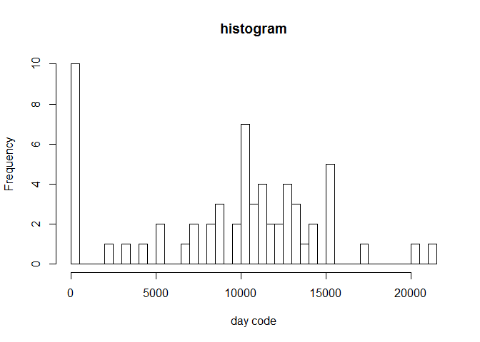

# reproductible_research
Sunday, January 10, 2016  

## The data
The data comes from https://d396qusza40orc.cloudfront.net/repdata%2Fdata%2Factivity.zip and was accessed 2016-01-10.

The data comes from a personal activity monitoring device which collects number of steps at 5 minute intervals through out the day. The data consists of two months of data from an anonymous individual collected during the months of October and November, 2012.
The variables included in this dataset are:
- steps: Number of steps taking in a 5-minute interval (missing values are coded as NA)
- date: The date on which the measurement was taken in YYYY-MM-DD format
- interval: Identifier for the 5-minute interval in which measurement was taken

### Loading and preprocessing the data

Data format needed readjusting which was done using the `ymd` function from lubridate package


```r
setwd("D:\\")
activity <- read.csv("activity.csv",header=TRUE,sep=",")
##check the data
head(activity)
```

```
##   steps       date interval
## 1    NA 2012-10-01        0
## 2    NA 2012-10-01        5
## 3    NA 2012-10-01       10
## 4    NA 2012-10-01       15
## 5    NA 2012-10-01       20
## 6    NA 2012-10-01       25
```

```r
##check data classes
sapply(activity,class)
```

```
##     steps      date  interval 
## "integer"  "factor" "integer"
```

```r
##transform the date
library(lubridate)
activity$date <- ymd(activity$date)
##check data classes
sapply(activity,class)
```

```
## $steps
## [1] "integer"
## 
## $date
## [1] "POSIXct" "POSIXt" 
## 
## $interval
## [1] "integer"
```

```r
##now date's ok
```
## What is mean total number of steps taken per day?

I calculate the daily sum of steps taken using "plyr" package. The result will be in V1 variable.

```r
library(plyr)
```

```
## 
## Attaching package: 'plyr'
## 
## The following object is masked from 'package:lubridate':
## 
##     here
```

```r
steps_daily <- ddply(activity, .(date), function(df) sum(df$steps, na.rm=TRUE))
```

The histogram is below.

```r
hist(steps_daily$V1, breaks=length(steps_daily$date),xlab="day code", main="histogram") # it's 2 hours before the deadline so I'll give up on converting the numbers to a meaningful format ;-)
```

 

The mean and median of steps taken a day needs replicating the code for daily sum with minor changes.

```r
params <- ddply(activity, .(date), function(df) data.frame(mean=mean(df$steps, na.rm=TRUE)
                                                          ,median=median(df$steps, na.rm=TRUE)))
```

The "report" in the task is quite ambiguous, so I'll both make plots

```r
plot(params$date, params$mean, col="red", type="b", xlab="day", ylab="steps", main="mean steps a day")
```

 

```r
plot(params$date, params$median, col="blue", type="b", xlab="day", ylab="steps", main="median steps a day")
```

 

and print out the results

```r
params
```

```
##          date       mean median
## 1  2012-10-01        NaN     NA
## 2  2012-10-02  0.4375000      0
## 3  2012-10-03 39.4166667      0
## 4  2012-10-04 42.0694444      0
## 5  2012-10-05 46.1597222      0
## 6  2012-10-06 53.5416667      0
## 7  2012-10-07 38.2465278      0
## 8  2012-10-08        NaN     NA
## 9  2012-10-09 44.4826389      0
## 10 2012-10-10 34.3750000      0
## 11 2012-10-11 35.7777778      0
## 12 2012-10-12 60.3541667      0
## 13 2012-10-13 43.1458333      0
## 14 2012-10-14 52.4236111      0
## 15 2012-10-15 35.2048611      0
## 16 2012-10-16 52.3750000      0
## 17 2012-10-17 46.7083333      0
## 18 2012-10-18 34.9166667      0
## 19 2012-10-19 41.0729167      0
## 20 2012-10-20 36.0937500      0
## 21 2012-10-21 30.6284722      0
## 22 2012-10-22 46.7361111      0
## 23 2012-10-23 30.9652778      0
## 24 2012-10-24 29.0104167      0
## 25 2012-10-25  8.6527778      0
## 26 2012-10-26 23.5347222      0
## 27 2012-10-27 35.1354167      0
## 28 2012-10-28 39.7847222      0
## 29 2012-10-29 17.4236111      0
## 30 2012-10-30 34.0937500      0
## 31 2012-10-31 53.5208333      0
## 32 2012-11-01        NaN     NA
## 33 2012-11-02 36.8055556      0
## 34 2012-11-03 36.7048611      0
## 35 2012-11-04        NaN     NA
## 36 2012-11-05 36.2465278      0
## 37 2012-11-06 28.9375000      0
## 38 2012-11-07 44.7326389      0
## 39 2012-11-08 11.1770833      0
## 40 2012-11-09        NaN     NA
## 41 2012-11-10        NaN     NA
## 42 2012-11-11 43.7777778      0
## 43 2012-11-12 37.3784722      0
## 44 2012-11-13 25.4722222      0
## 45 2012-11-14        NaN     NA
## 46 2012-11-15  0.1423611      0
## 47 2012-11-16 18.8923611      0
## 48 2012-11-17 49.7881944      0
## 49 2012-11-18 52.4652778      0
## 50 2012-11-19 30.6979167      0
## 51 2012-11-20 15.5277778      0
## 52 2012-11-21 44.3993056      0
## 53 2012-11-22 70.9270833      0
## 54 2012-11-23 73.5902778      0
## 55 2012-11-24 50.2708333      0
## 56 2012-11-25 41.0902778      0
## 57 2012-11-26 38.7569444      0
## 58 2012-11-27 47.3819444      0
## 59 2012-11-28 35.3576389      0
## 60 2012-11-29 24.4687500      0
## 61 2012-11-30        NaN     NA
```
## What is the average daily activity pattern?

I calculate the average per interval accross all days and plot it:

```r
interval_mean <- ddply(activity, .(interval), function(df) data.frame(mean=mean(df$steps, na.rm=TRUE)))
plot(interval_mean$interval, interval_mean$mean, type="l", xlab="interval", ylab="mean steps", main="steps in an interval averaged over all days")
```

 

I calculate the most active interval:

```r
index <- which.max(interval_mean$mean)
interval_mean[index, "interval"]
```

```
## [1] 835
```

## Imputing missing values

The total number of rows with NAs is:

```r
nrow(activity)-nrow(na.omit(activity))
```

```
## [1] 2304
```

My strategy for NAs in using the mean for that 5-minute interval. This is possible, since all the missing data is in steps only.

```r
##check where the data is missing
sapply(activity, function(df) sum(is.na(df)))
```

```
##    steps     date interval 
##     2304        0        0
```

```r
##impute NAs
activity_imp <- ddply(activity, .(interval), function(df) {
  df[is.na(df$steps)==TRUE, "steps"] <- interval_mean[interval_mean$interval == df[1,"interval"], "mean"]
  return(df)
  }
)
```

To check if the data was imputed, I rerun the following calculation:

```r
nrow(activity_imp)-nrow(na.omit(activity_imp))
```

```
## [1] 0
```

Let's recalculate the summary on the imputed data:

```r
activity_imp_summary <- ddply(activity_imp, .(date), function(df) data.frame(sum=sum(df$steps)
                                                                             ,mean=mean(df$steps)
                                                                             ,median=median(df$steps)))
##reporting everything
activity_imp_summary
```

```
##          date      sum       mean   median
## 1  2012-10-01 10766.19 37.3825996 34.11321
## 2  2012-10-02   126.00  0.4375000  0.00000
## 3  2012-10-03 11352.00 39.4166667  0.00000
## 4  2012-10-04 12116.00 42.0694444  0.00000
## 5  2012-10-05 13294.00 46.1597222  0.00000
## 6  2012-10-06 15420.00 53.5416667  0.00000
## 7  2012-10-07 11015.00 38.2465278  0.00000
## 8  2012-10-08 10766.19 37.3825996 34.11321
## 9  2012-10-09 12811.00 44.4826389  0.00000
## 10 2012-10-10  9900.00 34.3750000  0.00000
## 11 2012-10-11 10304.00 35.7777778  0.00000
## 12 2012-10-12 17382.00 60.3541667  0.00000
## 13 2012-10-13 12426.00 43.1458333  0.00000
## 14 2012-10-14 15098.00 52.4236111  0.00000
## 15 2012-10-15 10139.00 35.2048611  0.00000
## 16 2012-10-16 15084.00 52.3750000  0.00000
## 17 2012-10-17 13452.00 46.7083333  0.00000
## 18 2012-10-18 10056.00 34.9166667  0.00000
## 19 2012-10-19 11829.00 41.0729167  0.00000
## 20 2012-10-20 10395.00 36.0937500  0.00000
## 21 2012-10-21  8821.00 30.6284722  0.00000
## 22 2012-10-22 13460.00 46.7361111  0.00000
## 23 2012-10-23  8918.00 30.9652778  0.00000
## 24 2012-10-24  8355.00 29.0104167  0.00000
## 25 2012-10-25  2492.00  8.6527778  0.00000
## 26 2012-10-26  6778.00 23.5347222  0.00000
## 27 2012-10-27 10119.00 35.1354167  0.00000
## 28 2012-10-28 11458.00 39.7847222  0.00000
## 29 2012-10-29  5018.00 17.4236111  0.00000
## 30 2012-10-30  9819.00 34.0937500  0.00000
## 31 2012-10-31 15414.00 53.5208333  0.00000
## 32 2012-11-01 10766.19 37.3825996 34.11321
## 33 2012-11-02 10600.00 36.8055556  0.00000
## 34 2012-11-03 10571.00 36.7048611  0.00000
## 35 2012-11-04 10766.19 37.3825996 34.11321
## 36 2012-11-05 10439.00 36.2465278  0.00000
## 37 2012-11-06  8334.00 28.9375000  0.00000
## 38 2012-11-07 12883.00 44.7326389  0.00000
## 39 2012-11-08  3219.00 11.1770833  0.00000
## 40 2012-11-09 10766.19 37.3825996 34.11321
## 41 2012-11-10 10766.19 37.3825996 34.11321
## 42 2012-11-11 12608.00 43.7777778  0.00000
## 43 2012-11-12 10765.00 37.3784722  0.00000
## 44 2012-11-13  7336.00 25.4722222  0.00000
## 45 2012-11-14 10766.19 37.3825996 34.11321
## 46 2012-11-15    41.00  0.1423611  0.00000
## 47 2012-11-16  5441.00 18.8923611  0.00000
## 48 2012-11-17 14339.00 49.7881944  0.00000
## 49 2012-11-18 15110.00 52.4652778  0.00000
## 50 2012-11-19  8841.00 30.6979167  0.00000
## 51 2012-11-20  4472.00 15.5277778  0.00000
## 52 2012-11-21 12787.00 44.3993056  0.00000
## 53 2012-11-22 20427.00 70.9270833  0.00000
## 54 2012-11-23 21194.00 73.5902778  0.00000
## 55 2012-11-24 14478.00 50.2708333  0.00000
## 56 2012-11-25 11834.00 41.0902778  0.00000
## 57 2012-11-26 11162.00 38.7569444  0.00000
## 58 2012-11-27 13646.00 47.3819444  0.00000
## 59 2012-11-28 10183.00 35.3576389  0.00000
## 60 2012-11-29  7047.00 24.4687500  0.00000
## 61 2012-11-30 10766.19 37.3825996 34.11321
```
The histogram on imputed data showing the sum of steps taken each day (on top) and the original data for comparison (on bottom)

```r
#par(mfrow=c(2,1))
hist(activity_imp_summary$sum, breaks=length(activity_imp_summary$date),xlab="day code",main="imputed") # ;-)
```

 

```r
hist(steps_daily$V1, breaks=length(steps_daily$date),xlab="day code", main="original") # it's 2 hours before the deadline so I'll give up on 
```

 
One can see that imputing decreased near zero values and increased heights of bins near the center of the histogram. It makes sense since I used mean values to impute.

Let's now see if means and medians differ.

```r
##make sure the data is sorted the same way
params <- params[order(params$date),]
activity_imp_summary <- activity_imp_summary[order(activity_imp_summary$date),]
##check the differences in mean
params$mean - activity_imp_summary$mean
```

```
##  [1] NaN   0   0   0   0   0   0 NaN   0   0   0   0   0   0   0   0   0
## [18]   0   0   0   0   0   0   0   0   0   0   0   0   0   0 NaN   0   0
## [35] NaN   0   0   0   0 NaN NaN   0   0   0 NaN   0   0   0   0   0   0
## [52]   0   0   0   0   0   0   0   0   0 NaN
```

```r
##check the difference in median
params$median - activity_imp_summary$median
```

```
##  [1] NA  0  0  0  0  0  0 NA  0  0  0  0  0  0  0  0  0  0  0  0  0  0  0
## [24]  0  0  0  0  0  0  0  0 NA  0  0 NA  0  0  0  0 NA NA  0  0  0 NA  0
## [47]  0  0  0  0  0  0  0  0  0  0  0  0  0  0 NA
```
It turns out that there is no difference in either means or medians.

## Are there differences in activity patterns between weekdays and weekends?


```r
activity_imp$day_type <- "weekday"
##this one is needed to switch to English when knitting... a workaround, but...
Sys.setlocale("LC_ALL","English")
```

```
## [1] "LC_COLLATE=English_United States.1252;LC_CTYPE=English_United States.1252;LC_MONETARY=English_United States.1252;LC_NUMERIC=C;LC_TIME=English_United States.1252"
```

```r
activity_imp[weekdays(activity_imp$date) %in% c("Saturday", "Sunday"), "day_type"] <- "weekend"
```
Let's calculate the average number of steps taken in the 5 minutes interval, averaged across all weekday days or weekend days:

```r
activity_imp_day_type_summary <- ddply(activity_imp, .(day_type, interval), function(df) data.frame(mean=mean(df$steps)))
```
Let's plot:

```r
#par(mfrow=c(1,1))
##splitting by day_type into 2 subsets
wk_d <- activity_imp_day_type_summary[activity_imp_day_type_summary$day_type == "weekday",]
wk_e <- activity_imp_day_type_summary[activity_imp_day_type_summary$day_type == "weekend",]
##max mean for y axis
mx <- max(wk_d$mean, wk_e$mean)
plot(wk_d$interval, wk_d$mean, col="red", ylim=c(0,mx), type="l",xlab="interval",ylab="mean",main="weekend vs weekday")
par(new=TRUE)
plot(wk_e$interval, wk_e$mean, col="blue", ylim=c(0,mx), type="l",xlab="interval",ylab="mean",main="weekend vs weekday")
legend(x="topright",legend=c("weekday", "weekend"), fill=c("red", "blue"))
```

 
And it is good to see that not only I like lazy weekend mornings :-).


